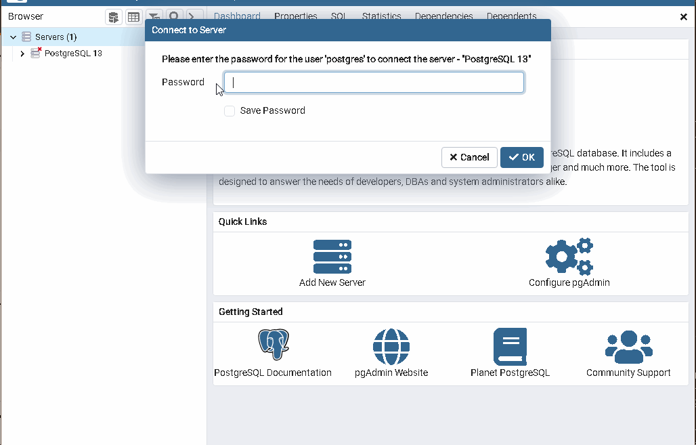

# proj_fetch_meta_data_team_83

This is the fetch meta data repository for team 83

# team_83

Zuri github repo for our project

## create a pull request

1. clone the repo using `git clone https://github.com/zuri-training/proj_fetch_meta_data_team_83/`

2. open your terminal and cd into team_83 using `cd proj_fetch_meta_data_team_83`

3. create a new branch with your username using `git checkout -b <your-username>`
   _please replace your-username with the user name you are using on slack_

4. Then add it to the repository using `git remote add upstream https://github.com/zuri-training/proj_fetch_meta_data_team_83`

5. create a `.env` file and add it to your `.gitignore` file

6. push it back to github using `git push -u origin <your-username>`

## configure the project for local machine

1. Create a virtual environment and activate `python -m venv env`
   - To activate in windows powershell `env\Scripts\activate.ps1`
   - To activate in command prompt (cmd) `env\Scripts\activate`
   - To activate in bash `source env/Scripts/activate`
     NB: If you use any other name to replace "env" above, add it to your .gitignore file
2. upgrade pip using `pip install --upgrade pip`
3. install the dependencies using `pip install -r requirements.txt`
4. cd into the project folder `cd fetch_metadata`

## Configure your database

1. Go to [postgresql website](https://www.enterprisedb.com/downloads/postgres-postgresql-downloads) and download postgresql database version 13.7 for uniformity
2. Install with adminstrator priviledges and set your superuser password
3. open pgAdmin 4     
   - click server, and right click you PostgreSQL version
   - create new database and input your superuser password
4. Type the following in your `.env` file
   <!-- PG_DB = '<database_name>'
   PG_USER = '<postgres_user>'
   PG_PASSWORD = "<your_password>"
   PG_HOST = "127.0.0.1"
   PG_PORT = "<port_number>" -->
   _The postgres-user is usually_ `postgres` _and The port number is usually_ `5432` _unless you changed it_
5. run `python manage.py runserver`
